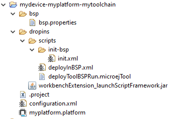

=============================
Create a new MicroEJ Platform
=============================

This section describes the steps to create a new MicroEJ Platform in MicroEJ SDK, 
and options to connect it to an external Board Support Package (BSP) as well as a third-party C toolchain. 

First, start MicroEJ SDK on a new empty :ref:`workspace <workspace>`.

.. _import_architecture:

Import a MicroEJ Architecture
=============================

The next step is to import a :ref:`MicroEJ Architecture <architecture_overview>`. 
MicroEJ Architectures for most common microcontroller instructions sets and compilers
can be downloaded from https://repository.microej.com/architectures/. 

MicroEJ Architecture files ends with the ``.xpf`` extension, and are classified using the following folder naming convention:

:: 

  com/microej/architecture/[ISA]/[TOOLCHAIN]/[UID]/[VERSION]/

For example, the MicroEJ Architecture versions for Arm® Cortex®-M4 microcontrollers compiled with GNU CC toolchain is available at 
https://repository.microej.com/architectures/com/microej/architecture/CM4/CM4hardfp_GCC48/flopi4G25/.

Once you downloaded a MicroEJ Architecture file, proceed with the following steps to import it in MicroEJ SDK:

- Select :guilabel:`File` > :guilabel:`Import` > :guilabel:`MicroEJ` > :guilabel:`Architectures`.
- Browse an ``.xpf`` file or a directory that contains one or more an ``.xpf`` files.
- Check the :guilabel:`I agree and accept the above terms and conditions...` box to accept the license.
- Click on :guilabel:`Finish` button.


.. _platform_configuration_creation:

Create a New MicroEJ Platform Configuration
===========================================

The next step is to create a MicroEJ Platform configuration:

-  Select :guilabel:`File` > :guilabel:`New` > :guilabel:`MicroEJ Platform Project…`.

-  Click on :guilabel:`Next` button. The Configure Target Architecture page allows to
   select the MicroEJ Architecture that contains a minimal MicroEJ
   Platform and a set of compatible modules targeting a processor
   architecture and a compilation toolchain. This environment can be
   changed later.

   -  Click on :guilabel:`Browse...` button to select one of the installed MicroEJ
      Architecture.

   -  Check the :guilabel:`Create from a platform reference implementation` box to
      use one of the available implementation. Uncheck it if you want to
      provide your own implementation or if no reference implementation
      is available.

-  Click on :guilabel:`Next` button. The Configure platform properties contains the
   identification of the MicroEJ Platform to create. Most fields are
   mandatory, you should therefore set them. Note that their values can
   be modified later on.

-  Click on :guilabel:`Finish` button. A new project ``[device]-[name]-[toolchain]`` is being created
   containing a ``[name].platform`` file. A platform description editor shall then
   open.

-  Install `Platform Configuration Additions <https://github.com/MicroEJ/PlatformQualificationTools/trunk/framework/platform/>`_ 
   ``content`` directory files to the project folder, by following instructions at https://github.com/MicroEJ/PlatformQualificationTools/trunk/framework/platform/README.rst.
   
You should get a MicroEJ Platform configuration project that looks like:



   Platform with no BSP configuration


Groups / Modules Selection
==========================

Group
From the platform description editor, select the Content tab to access
the platform modules selection. Modules can be selected/deselected from
the Modules frame.

Modules are organized into groups. When a group is selected, by default,
all its modules are selected. To view the modules making up a group,
click on the Show/Hide modules icon on the top-right of the frame. This
will let you select/deselect on a per module basis. Note that individual
module selection is not recommended.

The description and contents of an item (group or module) are displayed
beside the list on item selection.

All the checked modules will be installed in the platform.


Modules Customization
=====================

Each selected module can be customized by creating a [module] folder
named after the module beside the ``[name].platform`` definition. It may
contain:

-  An optional [module].properties file named after the module name.
   These properties will be injected in the execution context prefixed
   by the module name. Some properties might be needed for the
   configuration of some modules. Please refer to the modules
   documentation for more information.

-  Optional module specific files and folders.

Modifying one of these files requires to build the platform again.


.. _platformCustomization:

Platform Customization
======================

Platform can be customized by creating a ``configuration.xml`` script
beside the ``[name].platform`` file. This script can extend one or
several of the extension points available. By default, you should not have to change 
the default configuration script.

Configuration project (the project which contains the
``[name].platform`` file) can contain an optional ``dropins`` folder.
The contents of this folder will be copied integrally into the final
platform. This feature allows to add some additional libraries, tools
etc. into the platform.

The dropins folder organization should respect the final platform files
and folders organization. For instance, the tools are located in the
sub-folder ``tools``. Launch a platform build without the dropins folder
to see how the platform files and folders organization is. Then fill the
dropins folder with additional features and build again the platform to
obtain an advanced platform.

The dropins folder files are kept in priority. If one file has the same
path and name as another file already installed into the platform, the
dropins folder file will be kept.

Modifying one of these files requires to build the platform again.

BSP Connection
==============

Principle
---------

Using a MicroEJ Platform, the user can compile a MicroEJ Application on that platform. 
The result of this compilation is a ``microejapp.o`` file.

This file has to be linked with the MicroEJ Platform runtime file (``microejruntime.a``) 
and a third-party C project, called the Board Support Package (BSP) 
to obtain the final binary file (MicroEJ Firmware).
For more information, please consult the :ref:`MicroEJ build process overview <build_process_overview>`.

BSP connection consists in defining the 4 directories where are located:

- MicroEJ Application file (``microejapp.o``).
- MicroEJ Platform runtime file (``microejruntime.a``)
- MicroEJ Platform header files (``*.h``).
- BSP project external scripts
  
  - ``build.[bat|sh]`` to produce the final executable file (``application.out```)
  - ``run.[bat|sh]`` to run the final executable file on device

.. note::

   The final build stage can be done outside MicroEJ SDK, and thus 
   the BSP connection configuration is optional.
   
   However, it is required for the following cases:

   - Use MicroEJ SDK to produce the final executable file of a Mono-Sandbox Firmware (recommended).
   - Build of a Multi-Sandbox Firmware.
   - Run of a :ref:`MicroEJ Testsuite <testsuite>` on device.

To suit all the business cases as well as projects and teams organizations, MicroEJ allows to configure BSP connection
either at MicroEJ Platform level or at MicroEJ Application or using a mix of both:

- Case 1: Platform with no BSP configuration

  The MicroEJ Platform does not know BSP at all.
  BSP connection will be configured as MicroEJ Application options (absolute paths).

  .. figure:: images/bsp-connection-cases-none.png
     :alt: Platform with no BSP configuration
     :align: center

     Platform with no BSP configuration

  This case is suitable when:

  - the MicroEJ Firmware is built outside MicroEJ SDK.
  - the same MicroEJ Platform is intended to be reused on multiple BSP projects which do not share the same structure

- Case 2: Platform with partial BSP configuration
  
  The MicroEJ Platform knows how the BSP is structured.
  BSP connection will be configured as MicroEJ Platform options (relative paths within the BSP), 
  and the BSP root location will be provided as a MicroEJ Application option (absolute path of the BSP parent directory).

  .. figure:: images/bsp-connection-cases-partial.png
     :alt: Platform with partial BSP configuration
     :align: center

     Platform with partial BSP configuration

  This case is suitable when there is one MicroEJ Application, one MicroEJ Platform, and one BSP.

- Case 3: Platform with full BSP configuration
  
  The MicroEJ Platform includes its BSP.
  BSP connection will be configured as MicroEJ Platform options (relative paths within the BSP), 
  Nothing need to be configured at MicroEJ Application level.

  .. figure:: images/bsp-connection-cases-full.png
     :alt: Platform with full BSP configuration
     :align: center

     Platform with full BSP configuration

  This case is suitable when:

  - the MicroEJ Platform is used to build multiple different MicroEJ Applications.
  - the MicroEJ Platform and its BSP is fully validated without the final application (perhaps subcontracted) and delivered as a single package.

BSP Connection Options
----------------------

MicroEJ Platform Options
^^^^^^^^^^^^^^^^^^^^^^^^

MicroEJ Application Options
^^^^^^^^^^^^^^^^^^^^^^^^^^^


The BSP tool is able to configure automatically the device C project.
Fill the ``bsp`` > ``bsp.properties`` properties file to enable the
third-party C project configuration during the MicroEJ Platform build.

The properties file can contain the following properties:

-  ``project.file`` [optional, default value is "" (*empty*)]: Defines
   the full path of the C project file. This file will be updated with
   the platform libraries. If not set or empty, no C project is updated.

-  ``project.libs.group.name`` [optional, default value is ""
   (*empty*)]: Defines the libraries group name of the C project file.
   This property is required if property ``project.file`` is set.

-  ``project.includes.output.dir`` [optional, default value is ""
   (*empty*)]: Defines the full path of the C project's other header
   files (*.h) output directory. All platform header files (*.h) will be
   copied into that directory. If not set or empty, no header platform
   files are copied.


BSP Files
---------

The MicroEJ Platform needs some information about the device project (the
BSP). This information is required for building a MicroEJ Application
that is compatible with the BSP.

Some BSP files (XML files) are required to configure the MicroEJ
Platform modules. The name of these files must be ``bsp.xml``. They must
be stored in each module's configuration folder.

This file must start with the node ``<bsp>``. It can contain several
lines like this one:
``<nativeName="A_LLAPI_NAME" nativeImplementation name="AN_IMPLEMENTATION_NAME"/>``
where:

-  ``A_LLAPI_NAME`` refers to a Low Level API native name. It is
   specific to the MicroEJ C library which provides the Low Level API.

-  ``AN_IMPLEMENTATION_NAME`` refers to the implementation name of the
   Low Level API. It is specific to the BSP; and more specifically, to
   the C file which does the link between the MicroEJ C library and the
   C driver.

Example:

::

   <bsp>
       <nativeImplementation name="COMM_DRIVER" nativeName="LLCOMM_BUFFERED_CONNECTION"/>
   </bsp>

These files will be converted into an internal format during the
MicroEJ Platform build.

Build MicroEJ Platform
======================

To build the MicroEJ Platform, click on the Build Platform link on the
platform configuration Overview.

It will create a MicroEJ Platform in the workspace available for the
MicroEJ project to run on. The MicroEJ Platform will be available in:
:guilabel:`Window` > :guilabel:`Preferences` > :guilabel:`MicroEJ` > :guilabel:`Platforms in workspace`.


..
   | Copyright 2008-2020, MicroEJ Corp. Content in this space is free 
   for read and redistribute. Except if otherwise stated, modification 
   is subject to MicroEJ Corp prior approval.
   | MicroEJ is a trademark of MicroEJ Corp. All other trademarks and 
   copyrights are the property of their respective owners.
